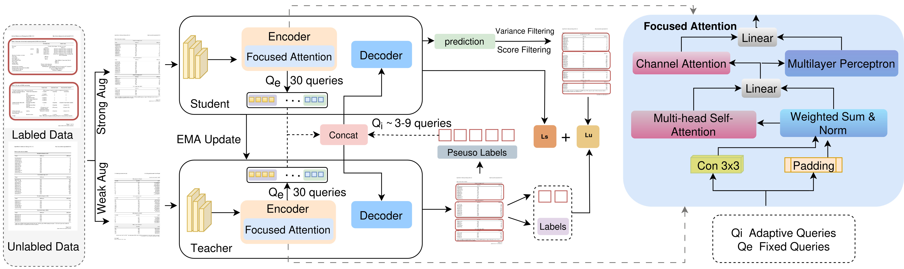
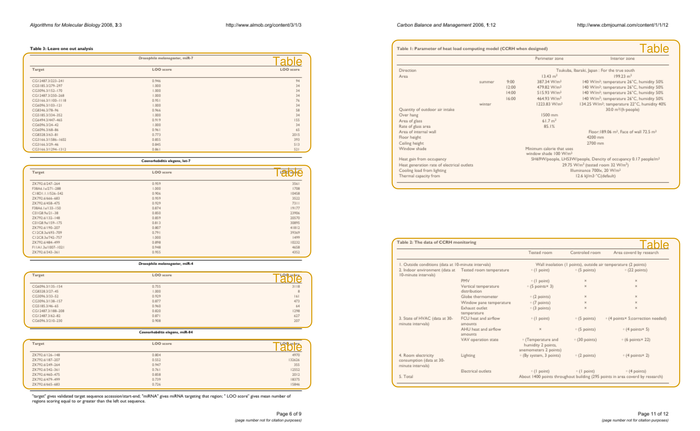

# DocSemi
[](https://example.com/your-paper-link)
[](https://github.com/tahirashehzadi/DocSemi/issues)
[](https://github.com/tahirashehzadi/DocSemi/blob/main/LICENSE)
<div style="text-align: center;">
    
</div>

## Getting Started
### Table of Content
- [Installation](#installation)
- [Data Preparation](#data-preparation)
- [Training](#training)
- [Evaluation](#evaluation)
- [Results](#results)
- [Example](#example)
### Installation
1. Clone the repository:
    ```sh
    git clone https://github.com/tahirashehzadi/DocSemi.git
    cd DocSemi
    ```

2. Create a virtual environment:
    ```sh
    conda create -n docsemi python=3.8
    conda activate docsemi
    ```

3. Install PyTorch:
    ```sh
    conda install pytorch==1.9.0 torchvision==0.10.0 torchtext==0.10.0 cudatoolkit=10.2 -c pytorch
    ```
    
4. Please install mmdet in editable mode first:
     ```sh
    cd thirdparty/mmdetection && python -m pip install -e .
     ```
        
4. Building on mmdetection, we have developed a detection transformer module (detr_od) and a semi-supervised module (detr_ssod) in a similar manner. 
  These modules need to be installed first. Ensure you update the module names (detr_od and detr_ssod) in the setup.py file if necessary.
     ```sh
    cd ../../ && python -m pip install -e  .
     ```
         
6.This process will install mmdet, detr_od, and detr_ssod in the environment. Additionally, you need to compile the CUDA operations required for deformable attention:
  ```sh
   cd detr_od/models/utils/ops
   python setup.py build install
  ```

```
### Data Preparation
Download the [PubLaynet](https://developer.ibm.com/exchanges/data/all/publaynet/) dataset.
  ```sh
/publaynet/coco
    ├── train2017/
    ├── val2017/
    └── annotations/
  	   ├── instances_train2017.json
  	   └── instances_val2017.json
  ```

```
### Training

- To train the model in a fully supervised setting:
    ```sh
    sh tools/dist_train_detr_od.sh dino_detr ${GPUS}
    ```
- As an example, to train the model in a fully supervised setting with 1 GPUs, you would use the following command:
    ```sh
    sh tools/dist_train_detr_od.sh dino_detr 1
    ```
- To train the model with semi-supervised data:
    ```sh
    sh tools/dist_train_detr_ssod.sh dino_detr_ssod ${FOLD} ${PERCENT} ${GPUS}
    ```
- For instance, you can execute the following script to train our model using 30% labeled data with 2 GPUs on the first split:
    ```sh
    sh tools/dist_train_detr_ssod.sh dino_detr_ssod 1 30 2
    ```
### Evaluation
- To evaluate the model: 
    ```sh
    python tools/test.py <CONFIG_FILE_PATH> <CHECKPOINT_PATH> --eval bbox
    ```  

- For example, to evaluate the model in a semi-supervised setting: 
    ```sh
    python tools/test.py configs/detr_ssod/detr_ssod_dino_detr_r50_coco_120k.py \
    work_dirs_fan_table_Publaynet_Table_10/detr_ssod_dino_detr_r50_coco_120k/10/1/epoch_12.pth --eval bbox
    ```
We provide detailed results and models trained by us bellow:
### Results
| Label                  | mAP       | AP50    | AP75      | ARL       | Pth files |
|:----------------------:|:---------:|:-------:|:---------:|:---------:|:----------------------------------------------------------:|
| 10%                    | 96.2      |97.7     |97.6       |98.2       | [CKPT](https://drive.google.com/drive/folders/1dnZ010Yo-Xix1Pd56beTPaIfopSpUfVb?usp=drive_link) |
| 30%                    | 96.2      |97.7     |97.4       |98.3       | [CKPT](https://drive.google.com/file/d/1cRpZyOyWXz0RajxwtZEm3NYYZZWds6HG/view?usp=drive_link) |
| 50%                    | 95.9      |97.7     |97.5       |98.0       | [CKPT](https://drive.google.com/file/d/1gJMSdiV5yKFNlYYFjv3Gc-4UPbVjAc6Q/view?usp=drive_link)|

### Example

Below is a visual analysis of our approach on the Publaynet dataset.
<div style="text-align: center;">
    
</div>

### Acknowledgment

### Citation
````
````
